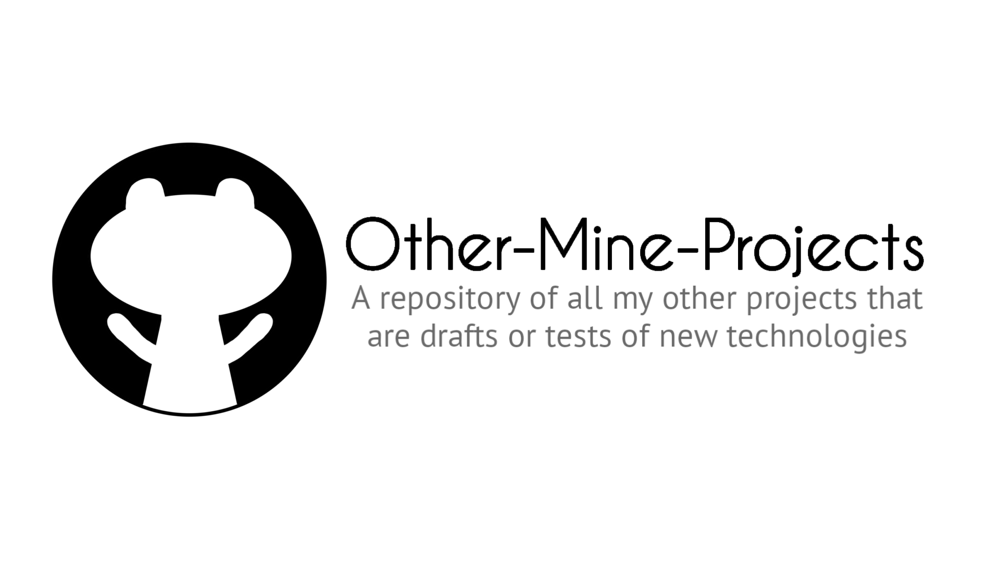
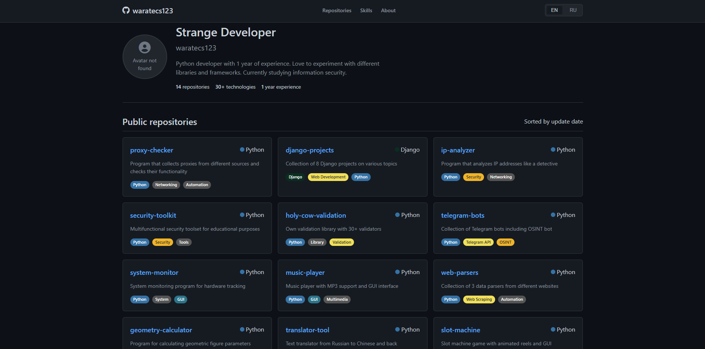

  

## Other-Mine-Projects

### [>> Website <<](https://other-mine-projects.pages.dev/)
### [>> Website (Alternative Link) <<](https://waratecs123.github.io/Other-Mine-Projects/)

This repository contains a collection of Python applications and utilities developed to demonstrate various programming paradigms, algorithmic solutions, and software development practices. The projects included here are not basic in nature, despite their relatively small size, and serve as an educational resource and code library for computational problems and interactive applications.

### Website Screenshot

  

### Projects

1. **Advanced Casino Slot Machine System (slot_machine.py).**
A casino-style slot machine simulation featuring real-time animation, multi-tiered symbols, dynamic jackpots, theme management, game state persistence, and statistical analytics. Implemented using object-oriented architecture with tkinter for the graphical user interface.

2. **Professional Translation Application (TRANSLATER.py).** 
A bilingual translation platform supporting Russian-Chinese translations with bidirectional functionality, speech synthesis, clipboard management, bulk text processing, and audio export. Utilizes modular design and asynchronous processing.

3. **Algorithmic Problem Suite (Basic tasks.py, Basic tasks.txt).**  
   A suite of 30 fundamental programming challenges covering mathematical computations, string processing, data structure operations, and algorithmic tasks such as prime detection, palindrome verification, and sorting implementations.

4. **Geometric Computation Library (class_objects.py).**
   A library for calculating properties of geometric shapes, including circles, polygons, triangles, quadrilaterals, and ellipses. Features input validation, inheritance-based hierarchy, and precise computations using the math library.

5. **System Monitoring Application (monitoring_app_system.py).** 
   A diagnostic tool for monitoring hardware components, including CPU, memory, GPU, storage, and system information. Employs multi-threaded data collection and real-time refresh capabilities.

6. **Intelligent Assistant Framework (assistant.py, data.py).** 
   A command-based assistant system with modules for system operations, computational tools, entertainment features, and productivity utilities. Supports plugin extensions and graphical user interface with command history.

7. **And many other projects (see the repository files)**

### Technical Specifications

- *Language*: Python 3.8 or higher.  
- *Dependencies*: Minimal external libraries, including requests, psutil, gTTS, pydub, speedtest, and googletrans. Install via pip install -r requirements.txt if a requirements file is provided.  
- *Framework*: Tkinter for graphical user interfaces where applicable.  
- *Compatibility*: Cross-platform, with modular architecture for extensibility.

### Installation

1. Clone the repository:  
   
   git clone https://github.com/waratecs123/Other-Mine-Projects.git
     
2. Navigate to the project directory:  
   
   cd Other-Mine-Projects
     
3. Install dependencies (if applicable):  
   
   pip install -r requirements.txt
   

### Usage

Each project is self-contained and can be executed independently. For example:  

python slot_machine.py
  
Refer to individual source files for detailed comments and usage instructions.

### License

This repository is licensed under the MIT License. See the LICENSE file for details.

  

